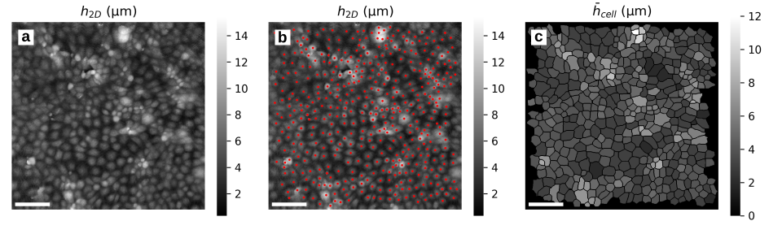

# Segmentation and analysis of epithelial monolayers
Code to segment single cells from 2D refractive index fields, and to analyse the three dimensional dynamics of both segmented cells and height fields.

## Used in:
- _Quantitative Phase Imaging of Epithelial Monolayer Dynamics_, [Bioarxiv](https://www.biorxiv.org/content/10.64898/2026.01.17.700037v1)
- _Three Dimensional Dynamics of Epithelial Monolayers_, [Bioarxiv](https://www.biorxiv.org/content/10.64898/2026.03.10.710903v1.abstract)

## Configs:
Contains configurations for segmenting and calibrating each dataset

## Scripts:
- analysis:
- preprocessing:
- utils:
- visualization:
